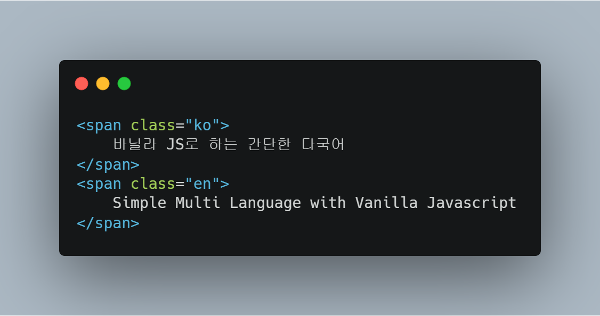
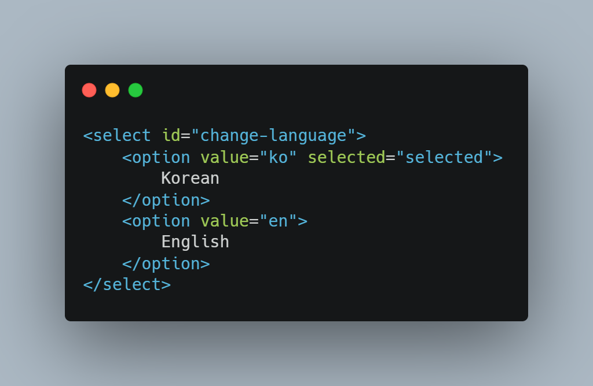
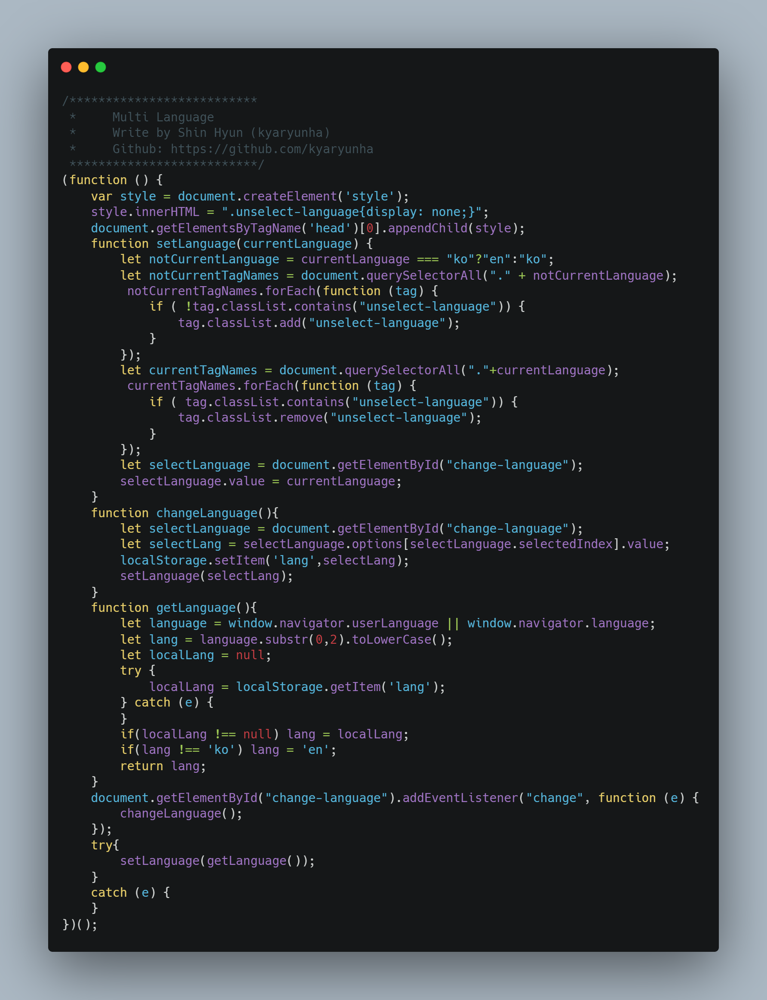

# MultiLanguage.js

MultiLanguage.js is Simple Multi Language with Vanilla Javascript

작성자: 신 현( Write by Hyun SHIN )

Demo Page: http://kyaryunha.com/multilanguage


## Introduce


이미 다양한 다국어 지원 방법이 있겠지만, 기존 수많은 방법들에 비해 이 프로젝트의 장점은 다음과 같다.

- HTML에서 해당 텍스트가 나타나는 부분에 번역을 작성할 수 있다.

- 48줄로 구현된 간단한 JS 파일

- HTML, CSS, JS만 사용되어 프론트엔드 입문자도 쉽게 사용 가능하다.


There are a lot of approaches to internationalisation, but this project offers unique advantages like: followings. 

- Inline translation in HTML documents
- Lightweight JavaScript implementation in 48 lines
- Written in pure HTML/CSS/JS so beginners can use it easily


## Usage:

#### HTML




```html
<h2 class="ko">
    바닐라 JS로 하는 간단한 다국어 지원
</h2>
<h2 class="en">
    Simple Multi Language with Vanilla Javascript
</h2> 

<select id="change-language">
	<option value="ko" selected="selected">
		Korean
	</option>
	<option value="en">
		English
	</option>
</select>
```


#### JS

##### 1.


```js
<script type="text/javascript" src="./MultiLanguage.js"></script>
```


OR

##### 2


