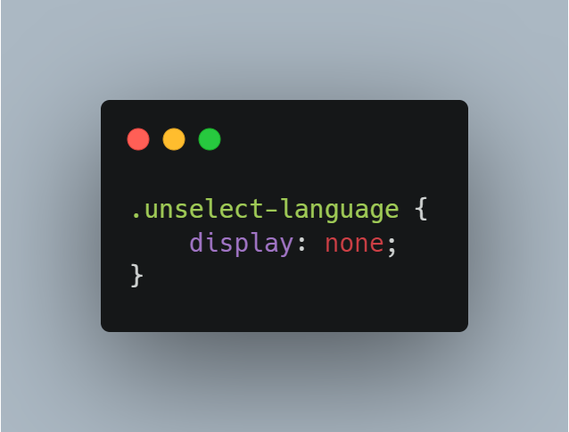

# MultiLanguage.js

MultiLanguage.js is Simple Multi Language with Vanilla Javascript

작성자: 신 현( Write by Hyun SHIN )


## Introduce

이미 다양한 다국어 지원 방법이 있겠지만, 기존 수많은 방법들에 비해 이 프로젝트의 장점은 다음과 같다.

There may already be various multilingual support methods, but the advantages of this project compared to the many existing methods are as follows.


- HTML에서 해당 텍스트가 나타나는 부분에 번역을 작성할 수 있다.
- 45줄로 구현된 간단한 JS 파일
- HTML, CSS, JS만 사용되어 프론트엔드 입문자도 쉽게 사용 가능하다.


- In HTML, you can write a translation where the text appears.
- Simple JS file implemented in 46 lines
- Only HTML, CSS, and JS are used, so even beginners can use it easily.


## Usage:

#### HTML


```html
<h2 class="ko">
    바닐라 JS로 하는 간단한 다국어 지원
</h2>
<h2 class="en">
    Simple Multi Language with Vanilla Javascript
</h2> 

<select name="language" id="change-language">
	<option value="ko" selected="selected" lang="ko">
		Korean
	</option>
	<option value="en" lang="en">
      	English
	</option>
</select>
```


#### CSS



```css
.unselect-language {
    display: none;
}
```

#### JS

##### 5.


```js
<script type="text/javascript" src="./MultiLanguage.js"></script>
```


OR

##### 2


